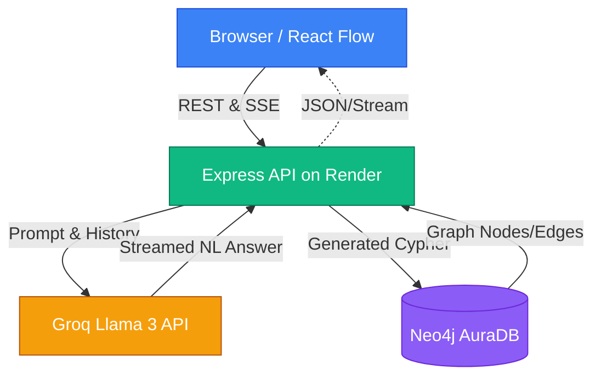

# O2C Graph Intelligence Platform

A Natural Language interface for querying an **Order-to-Cash (O2C)** supply chain Knowledge Graph. Ask questions in plain English, get answers backed by live Neo4j data, and explore relationships visually.

---

## Evaluation Criteria — How This Project Addresses Each

### 1. Graph Modelling
The data model maps the full O2C process as a property graph:

```
Customer ──[HAS_ADDRESS]──► Address
    ◄──[SOLD_TO]── SalesOrder ──[HAS_ITEM]──► SalesOrderItem
                                                 ──[IS_MATERIAL]──► Material
                                                                       ──[IS_PRODUCT]──► Product
                                                                                           ──[PRODUCED_AT]──► Plant
SalesOrderItem ◄──[DELIVERS_ITEM]── DeliveryItem ◄──[HAS_ITEM]── DeliveryDocument
DeliveryItem ◄──[BILLS_FOR_ITEM]── BillingItem ◄──[HAS_ITEM]── BillingDocument
                                                                     ◄──[PAYS_FOR]── Payment
                                                                     ◄──[ACCOUNTING_FOR]── JournalEntry
```

**13 node types, 11 relationship types.** Entities cover the complete flow from order creation to financial reconciliation.

---

### 2. Database / Storage Choice — Neo4j AuraDB

**Why a Graph Database over SQL?**

The O2C domain requires traversing 6+ relationship hops in a single query (e.g. `JournalEntry → BillingDocument → BillingItem → DeliveryItem → SalesOrderItem → Material → Product`). In a relational database this would require 6+ `JOIN`s with O(n) lookup cost per join. Neo4j traverses the same path in **O(hops)** — constant time regardless of dataset size.

**Why Neo4j specifically?**
- Cypher query language maps naturally to the pattern-matching queries an LLM generates
- AuraDB provides managed cloud hosting with no infrastructure overhead
- Native support for property graphs (nodes with attributes + typed relationships)

---

### 3. LLM Integration & Prompting — Groq + LangChain.js

**Translation pipeline:**
1. **Schema grounding** — full node/relationship schema injected into every prompt
2. **Few-shot examples** — 6 concrete Cypher examples for the required assessment queries
3. **Conversation memory** — last 5 turns passed to both Cypher generator and answer summarizer
4. **Output sanitization** — markdown fences stripped from LLM output before execution

**Why Groq?** Sub-second inference latency — essential for streaming token-by-token responses without perceptible delay.

---

### 4. Guardrails — Layered Defence

| Layer | Mechanism | What it blocks |
|---|---|---|
| 1 | LLM binary classifier (`YES/NO`) | Off-topic prompts (poems, general knowledge, etc.) |
| 2 | Keyword blacklist | `shortestPath`, `UNION` in generated Cypher |
| 3 | Runtime interceptor | Broad queries forced to `MATCH (n)-[r]->(m) LIMIT 100` |
| 4 | Null LLM guard | Requests with no API key return a clean error, not a crash |

---

### 5. Code Quality & Architecture

**Backend (MVC Architecture)**:
- Modularized clean architecture separated into `src/controllers`, `src/services`, `src/routes`, and `src/config`.
- `ChatService` isolates domain logic: guardrail check → Cypher generation → DB execution → answer generation.
- `ChatController` handles HTTP request parsing and response formatting.
- Dedicated standalone script for batch graph ingestion (`src/scripts/ingest.ts`).

**Frontend (Component-Based Architecture)**:
- Extracted monolithic UI into isolated, semantic components (`ChatPanel.tsx`, `TopNav.tsx`, `CustomDotNode.tsx`, `constants.ts`).
- `page.tsx` now purely acts as a cleanly organized State Orchestrator and logic entry point.
- React hooks (`useMemo`, `useCallback`) strategically placed for unblocked main thread performance of d3-force layout engines.

---

## Features

| Feature | Status |
|---|---|
| NL → Cypher query translation | ✅ |
| Graph visualization with React Flow | ✅ |
| Node expansion (double-click) | ✅ |
| Streaming LLM responses (SSE) | ✅ |
| Conversation memory (last 5 turns) | ✅ |
| Node highlighting from query results | ✅ |
| Semantic / entity search | ✅ |
| Graph clustering by entity type | ✅ |
| Node type filtering (legend) | ✅ |
| Multi-layer guardrails | ✅ |

---

## System Architecture Diagram



---

## Dataset Initialization & ETL Pipeline

The platform relies on highly complex logistics `.json` data mimicking enterprise Order-to-Cash databases. The raw datasets representing the original relational tables/documents are located in `datasets/`. 

To load the nodes and relationships into the live graph database, we engineered an autonomous ETL (Extract, Transform, Load) script: `backend/src/scripts/ingest.ts`. Running this script loops identically through every dataset file, formats the JSON logic into Neo4j nodes mapping directly to the 13 defined entities, and pushes the relationships perfectly to AuraDB.

---

## Local Setup

### Prerequisites
- Node.js 18+
- Neo4j AuraDB instance (free tier works)
- Groq API key (free at console.groq.com)

### Backend
```bash
cd backend
cp .env.example .env           # fill in NEO4J_URI, NEO4J_USERNAME, NEO4J_PASSWORD, GROQ_API_KEY
npm install
npx tsx src/scripts/ingest.ts  # loads all datasets into Neo4j (run once)
npm run dev                    # starts API with auto-reload on port 4000
```

### Frontend
```bash
cd frontend
npm install
npm run dev              # starts on http://localhost:3000
```

### Test Queries
```
Which products have the most billing documents?
Trace the full flow of billing document 91150175
Find sales orders delivered but not billed
Show me the entire supply chain graph
Show billing documents for delivery 80738076
How many unique customers do we have?
Which customers have the most sales orders?
```

---

## ☁️ Cloud Deployment (Vercel & Render)

This project features a completely free CI/CD decoupled architecture format.

### Backend (Render Free Tier)
1. Link your GitHub repository to a new Render **Web Service**.
2. **Root Directory:** `backend`
3. **Build Command:** `npm install`
4. **Start Command:** `npm start`
5. Inject the `.env` variables from your local setup into the Render Environment dashboard.

### Frontend (Vercel Hobby Tier)
1. Import the same GitHub repository to a new Vercel Project.
2. **Root Directory:** `frontend`
3. **Environment Variables:** Add a `NEXT_PUBLIC_API_URL` key, pointing to your brand new live Render Backend URL *(e.g. `https://my-backend.onrender.com`)* making sure there is no trailing slash.
4. Click Deploy!
